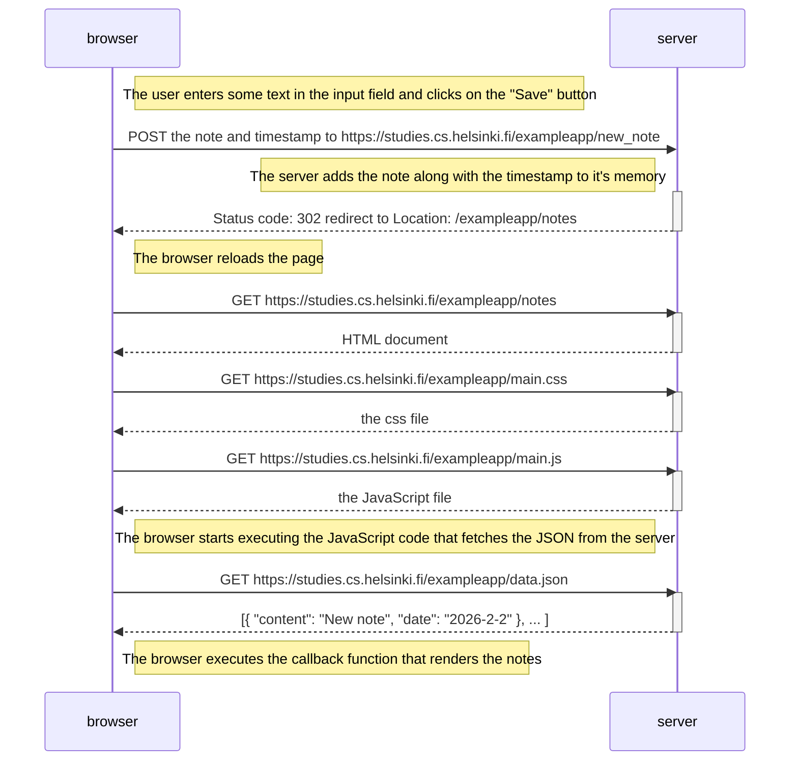

```mermaid

sequenceDiagram
    participant browser
    participant server

    Note right of browser: The user enters some text in the input field and clicks on the "Save" button
    browser->>server: POST the note and timestamp to https://studies.cs.helsinki.fi/exampleapp/new_note
    Note left of server: The server adds the note along with the timestamp to it's memory

    activate server
    server-->>browser: Status code: 302 redirect to Location: /exampleapp/notes
    deactivate server

    Note right of browser: The browser reloads the page
    browser->>server: GET https://studies.cs.helsinki.fi/exampleapp/notes
    activate server
    server-->>browser: HTML document
    deactivate server

    browser->>server: GET https://studies.cs.helsinki.fi/exampleapp/main.css
    activate server
    server-->>browser: the css file
    deactivate server

    browser->>server: GET https://studies.cs.helsinki.fi/exampleapp/main.js
    activate server
    server-->>browser: the JavaScript file
    deactivate server

    Note right of browser: The browser starts executing the JavaScript code that fetches the JSON from the server

    browser->>server: GET https://studies.cs.helsinki.fi/exampleapp/data.json
    activate server
    server-->>browser: [{ "content": "New note", "date": "2026-2-2" }, ... ]
    deactivate server

    Note right of browser: The browser executes the callback function that renders the notes

```