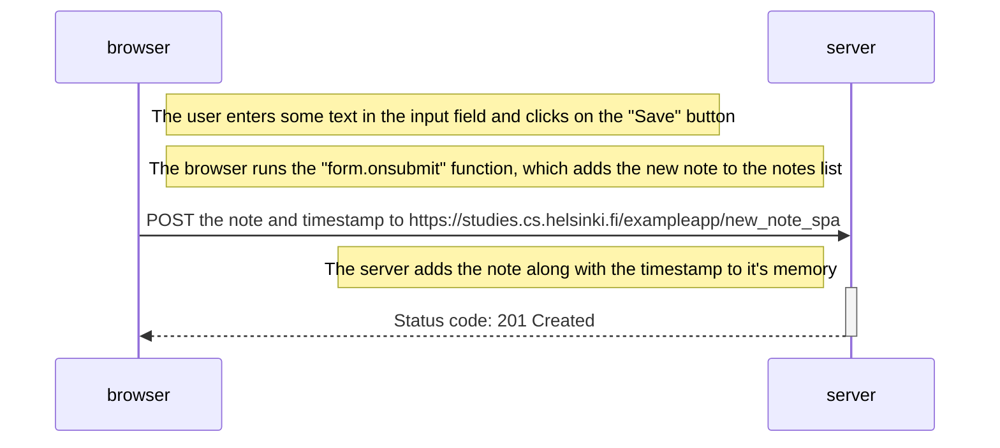

```mermaid

sequenceDiagram
    participant browser
    participant server

    Note right of browser: The user enters some text in the input field and clicks on the "Save" button
    Note right of browser: The browser runs the "form.onsubmit" function, which adds the new note to the notes list

    browser->>server: POST the note and timestamp to https://studies.cs.helsinki.fi/exampleapp/new_note_spa
    Note left of server: The server adds the note along with the timestamp to it's memory

    activate server
    server-->>browser: Status code: 201 Created
    deactivate server

```